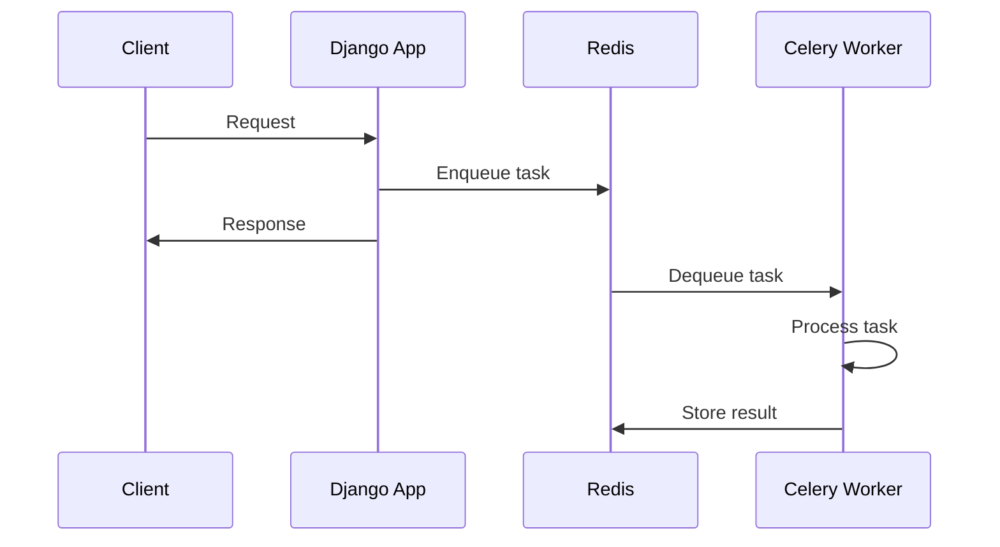
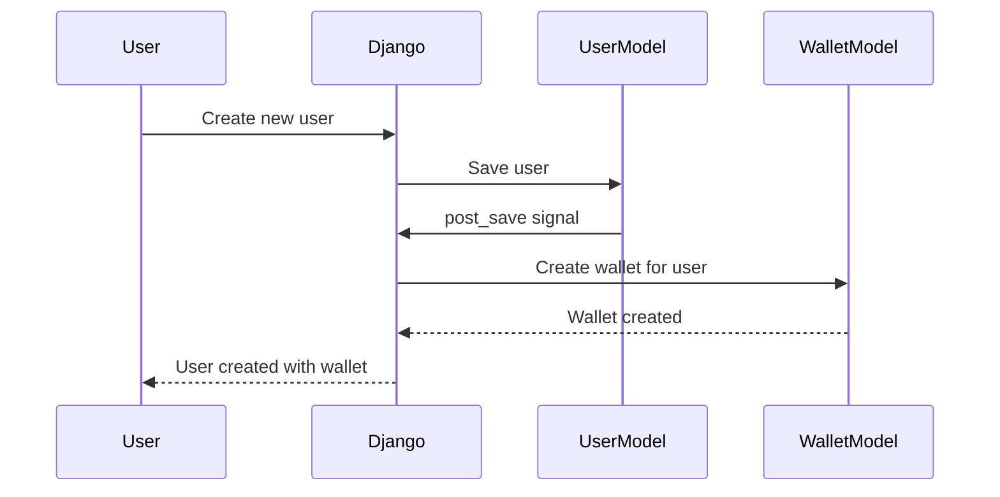
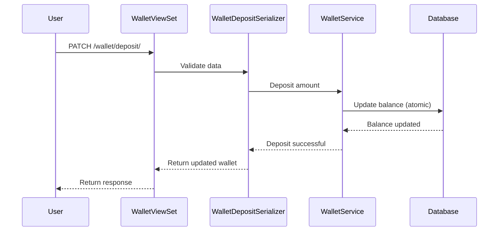
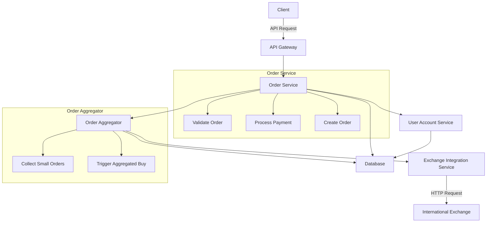

### Django Crypto Exchange

```mermaid
sequenceDiagram
    participant C as Client
    participant D as Django App
    participant R as Redis
    participant W as Celery Worker
    C ->> D: Request
    D ->> R: Enqueue task
    D ->> C: Response
    R ->> W: Dequeue task
    W ->> W: Process task
    W ->> R: Store result
```

User Registration and Wallet Creation

```mermaid
sequenceDiagram
    participant User
    participant Django
    participant UserModel
    participant WalletModel
    User->>Django: Create new user
    Django->>UserModel: Save user
    UserModel->>Django: post_save signal
    Django->>WalletModel: Create wallet for user
    WalletModel-->>Django: Wallet created
    Django-->>User: User created with wallet

```

User Deposit

```mermaid
sequenceDiagram
    participant User
    participant WalletViewSet
    participant WalletDepositSerializer
    participant WalletService
    participant Database
    User->>WalletViewSet: PATCH /wallet/deposit/
    WalletViewSet->>WalletDepositSerializer: Validate data
    WalletDepositSerializer->>WalletService: Deposit amount
    WalletService->>Database: Update balance (atomic)
    Database-->>WalletService: Balance updated
    WalletService-->>WalletDepositSerializer: Deposit successful
    WalletDepositSerializer-->>WalletViewSet: Return updated wallet
    WalletViewSet-->>User: Return response


```

```mermaid
graph TD
    A[Client] -->|API Request| B[API Gateway]
    B --> C[Order Service]
    C --> D[User Account Service]
    C --> E[Order Aggregator]
    E --> F[Exchange Integration Service]
    F -->|HTTP Request| G[International Exchange]
    C --> H[Database]
    E --> H
    D --> H
    
    subgraph "Order Service"
        C --> I[Validate Order]
        C --> J[Process Payment]
        C --> K[Create Order]
    end
    
    subgraph "Order Aggregator"
        E --> L[Collect Small Orders]
        E --> M[Trigger Aggregated Buy]
    end
```