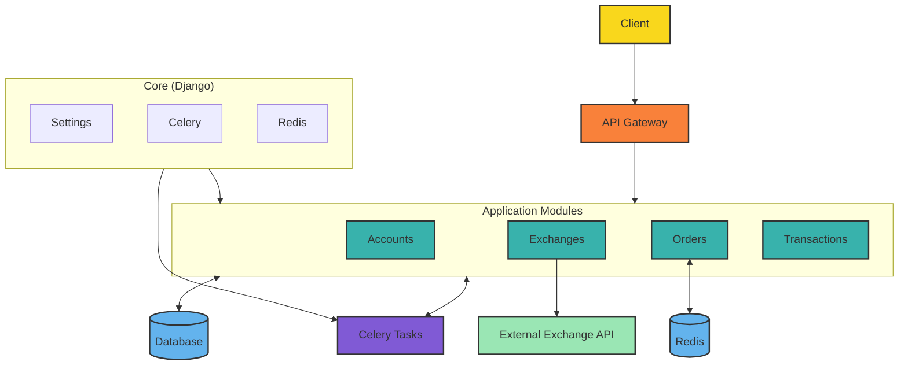
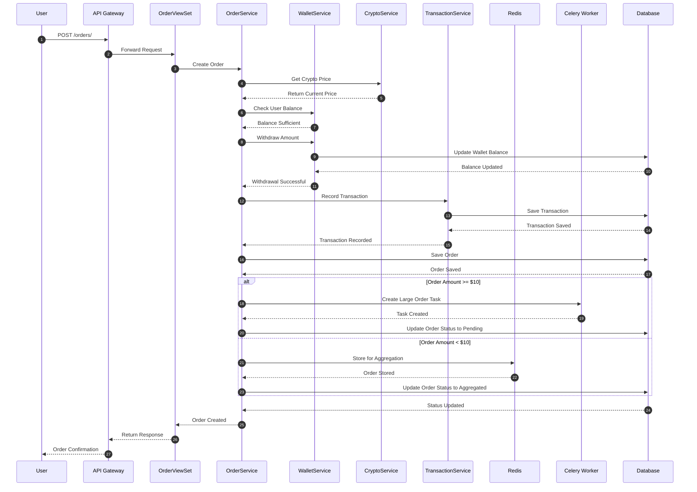
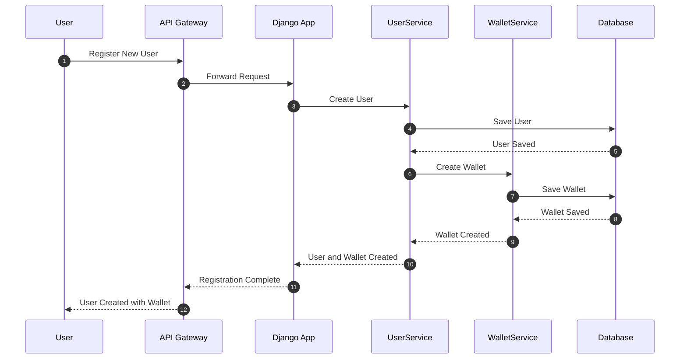
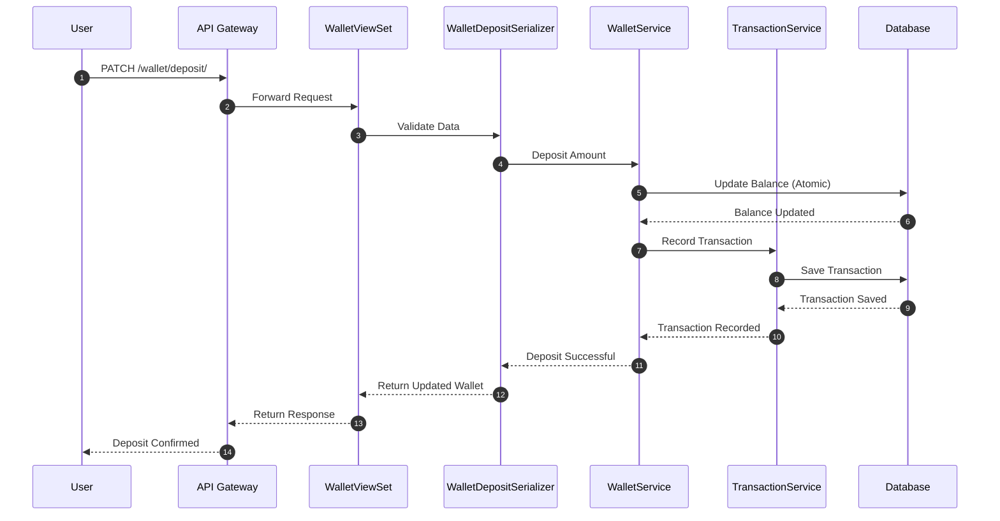
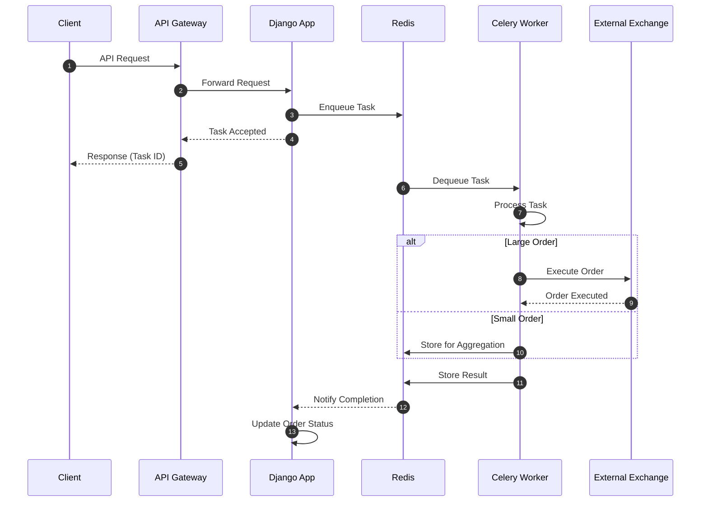

## Crypto Exchange with Django

A highly scalable Django-based application allowing users to purchase and manage cryptocurrencies. It includes advanced
features such as user authentication, wallet management, order processing, and asynchronous task handling using Celery.
The project is Dockerized for easy deployment and comes with auto-generated API documentation using Swagger and ReDoc.

## Table of Contents

- [Project Overview](#project-overview)
- [Features](#features)
- [System Architecture](#system-architecture)
- [System Design Solution](#system-design-solution)
- [Key Components](#key-components)
- [Core Workflow](#core-workflow)
- [Data Flow and Consistency Model](#data-flow-and-consistency-model)
- [API Design](#api-design)
- [Asynchronous Processing](#asynchronous-processing)
- [Aggregation Logic](#aggregation-logic)
- [Data Models](#data-models)
- [Scalability and Performance](#scalability-and-performance)
- [Security Considerations](#security-considerations)
- [Setup and Installation](#setup-and-installation)
- [Docker Usage](#docker-usage)
- [Environment Variables](#environment-variables)
- [Makefile Commands](#makefile-commands)
- [Testing](#testing)
- [API Documentation](#api-documentation)
- [Performance and Scalability](#performance-and-scalability)
- [Future Improvements](#future-improvements)
- [Contact](#contact)

## Project Overview

The Django Crypto Exchange allows users to purchase cryptocurrencies and manage their wallets. It implements a scalable
architecture with asynchronous processing for order handling and integrates with international exchanges. The project is
fully containerized using Docker and supports background tasks with Celery.

## Features

- **User Authentication**: Secure user registration and login using **JWT** tokens.
- **Wallet Management**: Manage user wallets with support for deposits and withdrawals.
- **Order Processing**: Create, process, and settle cryptocurrency purchase orders, beside aggregate small order on
  **Redis**
- **Asynchronous Tasks**: Handle order processing and exchange settlements using **Celery**.
- **International Exchanges**: Interface with international exchanges for cryptocurrency settlements.
- **Swagger and ReDoc**: Auto-generated API documentation for easy reference.
- **Dockerized**: Fully containerized application for easy deployment.
- **Testing**: Comprehensive test suite for all API endpoints.
- **Scalable Design**: Modular architecture for efficient, reliable, and scalable operations.
- **Performance**: Redis for efficient order aggregation and Celery for asynchronous task management.
- **Security**: Token-based authentication and atomic transactions for data integrity. besides, **fraud detection** and
  **rate limiter**.

### System Design Solution

#### **Introduction**

This document outlines the system design for an API that handles cryptocurrency purchase orders on an exchange platform.
The API facilitates cryptocurrency purchases, deducts the amount from the user’s wallet, and settles purchases through
international exchanges, with special handling for small purchases under $10.

#### **Objectives**

- Provide an API to handle cryptocurrency purchase orders.
- Deduct the cost of cryptocurrency from a user's wallet.
- Settle transactions with international exchanges, ensuring orders under $10 are aggregated before settlement.
- Ensure efficient, reliable, and scalable operations using Django and Celery for asynchronous tasks.

---

### **System Architecture**

The system follows a **modular architecture**, with the following components:

- **Accounts Module**: Manages user accounts and wallets.
- **Orders Module**: Handles the creation, processing, and aggregation of purchase orders.
- **Transactions Module**: Manages deposits, withdrawals, and other financial transactions.
- **Exchanges Module**: Interfaces with international exchanges for cryptocurrency settlements.
- **Redis and Celery**: Handles asynchronous task management, including order processing and aggregation logic.



#### Application Servers (Django)

- Processes API requests (e.g., placing orders, wallet management).
- Implements business logic for cryptocurrency purchases.

#### Caching Layer (Redis)

- Stores frequently accessed data (e.g., cryptocurrency prices, wallet balances).
- Implements rate limiting and session management.

#### Database Cluster (PostgreSQL)

- Primary data store for users, wallets, orders, and transaction statistics.
- *Implements sharding for horizontal scaling (e.g., by user ID or cryptocurrency).

#### Message Queue (Redis)

- Facilitates asynchronous communication between components (e.g., processing orders).
- Ensures reliable message delivery for background tasks.

#### Celery Workers

- Process background tasks (e.g., updating order statistics, handling transactions).
- Handle computationally intensive operations asynchronously.

---

### Consistency and CAP Theorem Considerations
The system prioritizes **Consistency (C)** and **Partition Tolerance (P)** from the CAP theorem, while maintaining a balanced approach to **Availability (A)**. In a financial system, such as a cryptocurrency exchange, strong consistency is crucial to ensure the accuracy of transactions and wallet balances. This design choice reduces the risk of double-spending and ensures users have a clear understanding of their available funds.

#### Eventual Consistency
- Transactions may not be immediately reflected in wallet balances due to the system's architectural decisions.
- Background processes are implemented to ensure that data eventually converges to a consistent state, using strategies like asynchronous updates and reconciliation processes.

### Fault Tolerance and Reliability
- **Data Replication**
  - Multi-region database replication is employed for disaster recovery, ensuring that the system can recover quickly from failures.
  - Read replicas are used to enhance read performance and reduce latency, allowing for faster access to frequently requested data.

- **Monitoring and Alerting**
  - Comprehensive monitoring is established using tools such as Prometheus and Grafana, providing real-time insights into system performance.
  - Alerts are configured for critical system metrics and error rates to promptly address issues before they affect users.

### Additional Considerations
- **Security Measures**: Given the financial nature of the platform, robust security protocols, including multi-factor authentication and encryption, are implemented to safeguard user data.
- **Transaction Integrity**: Strong mechanisms are in place to validate transactions and ensure their integrity, further enhancing user trust in the platform.

---

### **Key Components**

#### **Accounts**

- **User Model**: Each user has a unique wallet that tracks their available balance. Users can deposit and withdraw
  funds.
- **Wallet Model**: Each user has a wallet with a balance in a single currency (e.g., USD). For simplicity, no
  multi-coin wallets are considered in this design.

#### **Orders**

- **Order Model**: Tracks cryptocurrency purchase requests, including the cryptocurrency type, amount, total price, and
  the state of the order (e.g., pending, completed).
- **Order Processing**: Orders are created when users submit purchase requests. Based on the total order value, orders
  either:
    - Are processed immediately for amounts above $10.
    - Are aggregated and processed later for amounts below $10.

#### **Transactions**

- **Transaction Model**: Manages deposits and withdrawals, recording the amount, type (deposit or withdrawal), and the
  related order, if applicable.
- **WalletService**: Handles updates to wallet balances when purchases or deposits occur.

#### **Exchanges**

- **ExchangeService**: Acts as a placeholder for making real HTTP requests to an international exchange. It supports
  buying cryptocurrency in bulk for multiple orders.
- **Aggregated Purchases**: When orders are under `$10`, multiple purchases are aggregated and settled with the exchange
  once the cumulative total reaches $10 or
  more.

---

### **Core Workflow**

#### **Cryptocurrency Purchase**

1. **Request**: A user submits an API request to purchase a cryptocurrency.
2. **Validation**:
    - The system checks the user’s balance and verifies they have sufficient funds.
    - If funds are insufficient, an error is returned.
3. **Order Creation**:
    - An order is created with details such as the cryptocurrency, amount, and total price.
    - The user’s wallet is debited.
4. **Order Processing**:
    - If the total price is below the aggregation threshold ($10), the order is queued for aggregation.
    - If the price is above the threshold, the `buy_from_exchange` method is invoked immediately.
5. **Aggregation Handling**:
    - Small orders are aggregated using Redis. Once the cumulative order value reaches the threshold, the system
      triggers a bulk purchase from the exchange.
6. **Exchange Settlement**:
    - The `buy_from_exchange` method interacts with the international exchange to settle the purchase.

##### Diagram: Cryptocurrency Purchase Workflow



### Data Flow and Consistency Model

The system implements an eventual consistency model to ensure high availability. Here's how data flows through the
system:

#### Authentication (Login & Register)

- User submits a login or registration request.
- API Gateway validates the request and generates JWT tokens.
- Tokens are stored in the client for future requests.



#### Withdraw and deposit operations:

- Wallet balances are updated in the database.
- Transactions are recorded in the database.
- Wallet balances are recalculated and cached in Redis.



#### User submits a purchase order:

- API Gateway validates the request and applies rate limiting.
- Application server processes the order and performs initial validation.
- Order details are temporarily stored in Redis (pending orders).
- Acknowledgment is sent back to the user.

#### Background processing:

- Celery worker processes aggregated order or normal orders from Redis.
- Updates are applied to the PostgreSQL database in batches.
- Wallet balances and order statistics are recalculated and cached in Redis.

#### Read operations:

- Frequently accessed data (e.g., cryptocurrency prices) is served from Redis cache.
- Less frequent queries are served directly from the PostgreSQL database.

### API Design

This section outlines the available API endpoints for interacting with the cryptocurrency exchange system.

- Base URL: `http://localhost:8000/api/v1/`
- API documentation: `{base_url}/swagger/` or `{base_url}/redoc/`
- Authentication: JWT-based token authentication

#### **Endpoints**

- **POST accounts/auth/login/**:
    - Authenticates a user and returns access and refresh tokens.
    - ViewSet: `accounts.viewsets.authentication.LoginViewSet`
    - Example payload:
      ```json
      {
        "username": "user1",
        "password": "password123"
      }
      ```
    - Example response:
      ```json
      {
        "access": "eyJ0eXAi ...",
        "refresh": "eyJ0eXAi ..."
      }
        ```

- **POST accounts/auth/register/**:
    - Registers a new user and creates an associated wallet.
    - ViewSet: `accounts.viewsets.authentication.RegisterViewSet`
    - Example payload:
      ```json
      {
        "username": "user1",
        "password": "password123"
      }
      ```
    - Example response:
      ```json
      {
        "access": "eyJ0eXAi ...",
        "refresh": "eyJ0eXAi ..."
      }
        ```

- **POST orders/**:
    - Creates a new cryptocurrency purchase order.
    - Example payload:
      ```json
      {
        "crypto": "ABAN",
        "amount": 3
      }
      ```
- **GET orders/{id}/**:
    - Retrieves the details of a specific order by its primary key (id).
    - Example response:
      ```json
      {
        "id": 1,
        "crypto": "ABAN",
        "amount": 3,
        "total_price": 12.00,
        "state": "completed"
      }
      ```

- **PATCH accounts/wallet/deposit**:
    - Deposits funds into a user's wallet.
    - Example payload:
      ```json
      {
        "amount": 100.00
      }
      ```

- **GET accounts/wallet/**:
    - Retrieves the current wallet information for the authenticated user.
    - Example response:
      ```json
      {
        "balance": 500.00
      }
      ```

- **GET exchanges/crypto-currencies/**:
    - Retrieves a list of available cryptocurrencies along with their prices.
    - Example response:
      ```json
      [
        {
          "name": "ABAN",
          "price": 4.00
        },
        {
          "name": "BTC",
          "price": 50000.00
        }
      ]
      ```

- **GET /transactions/**:
    - Retrieves a list of transactions associated with the authenticated user's wallet.
    - Example response:
      ```json
      [
        {
          "id": 1,
          "type": "deposit",
          "amount": 100.00,
          "order_id": null,
          "created_at": "2024-09-27T12:30:00Z"
        },
        {
          "id": 2,
          "type": "withdrawal",
          "amount": 50.00,
          "order_id": 5,
          "created_at": "2024-09-27T13:30:00Z"
        },
        {
          "id": 2,
          "type": "withdrawal",
          "amount": 50.00,
          "order_id": 5,
          "created_at": "2024-09-27T13:30:00Z"
        }
      ]
      ```

- **GET /transactions/{id}**:
    - Retrieves the details of a specific transaction by its primary key (id).
    - Example response:
      ```json
      {
        "id": 1,
        "type": "deposit",
        "amount": 100.00,
        "order_id": null
      }
      ```

---

### Asynchronous Processing

- **Task: process_large_order**: Handles immediate purchase orders where the total price exceeds \$10.
- **Task: process_aggregate_orders**: Handles order aggregation and initiates purchase when cumulative orders surpass \$10.

```python

@shared_task
def process_aggregate_orders(*, order_id, crypto_name, new_total_price):
    """
    This function processes aggregate orders using Redis Lock to handle concurrency 
    and Redis Pipeline to ensure atomicity of the Redis operations.
    """

    redis_name = RedisNameTemplates.aggregate_orders(crypto_name=crypto_name)
    lock = RedisClient.lock(f"{redis_name}:lock", timeout=settings.LOCK_TIMEOUT)  # Create a Redis lock

    try:
        # Acquiring the Redis lock (blocking until the lock is acquired)
        if lock.acquire(blocking=True):
            with RedisClient.pipeline() as pipe:
                # Use pipeline for atomic operations
                pipe.hincrbyfloat(redis_name, "total_price", float(new_total_price))
                pipe.rpush(f"{redis_name}:order_ids", order_id)
                pipe.execute()  # Execute all the pipelined commands atomically

            # Fetch the updated total price from Redis
            updated_total_price = Decimal(RedisClient.hget(redis_name, "total_price") or 0)

            if updated_total_price >= settings.AGGREGATION_THRESHOLD:
                # Fetch all the order IDs associated with this batch from Redis
                order_ids = RedisClient.lrange(f"{redis_name}:order_ids", 0, -1)

                # Execute the exchange buy process in an atomic transaction
                with transaction.atomic():
                    ExchangeService.buy_from_exchange(crypto_name=crypto_name, amount=updated_total_price)
                    Order.objects.filter(id__in=order_ids).update(state=OrderStates.COMPLETED)

                # Clean up Redis keys for the current batch of aggregated orders
                RedisClient.delete(redis_name)
                RedisClient.delete(f"{redis_name}:order_ids")

    except LockError:
        # Handle failure to acquire the lock
        print("Failed to acquire the Redis lock. Retrying...")
        process_aggregate_orders.delay(order_id=order_id, crypto_name=crypto_name, new_total_price=new_total_price)

    finally:
        # Ensure that the lock is always released, even if an error occurs
        lock.release()
```
---

### **Aggregation Logic**

#### **Redis Usage**

Redis is used to store aggregated orders:

- Redis tracks the total amount and total price for each cryptocurrency.
- Once the cumulative value of aggregated orders reaches the threshold ($10), the system triggers a bulk purchase.

#### **Periodic Check**

A periodic task scans Redis for partially aggregated orders. If any orders exceed the threshold, they are processed in
bulk.

##### Task Processing with Redis and Celery diagram



---

### **Data Models**

#### **Base Model**

```python
class BaseModel(models.Model):
    created_at = models.DateTimeField(auto_now_add=True)
    updated_at = models.DateTimeField(auto_now=True)

    class Meta:
        abstract = True
```

#### **Wallet Model**

```python
class Wallet(BaseModel):
    user = models.OneToOneField(User, on_delete=models.CASCADE)
    balance = models.DecimalField(max_digits=10, decimal_places=2, default=0.00)
```

#### **CryptoCurrency Model**

```python
class CryptoCurrency(BaseModel):
    name = models.CharField(max_length=10, unique=True)
    price = models.DecimalField(max_digits=10, decimal_places=2)
```

#### **Transaction Model**

```python
class Transaction(BaseModel):
    wallet = models.ForeignKey(Wallet, on_delete=models.CASCADE)
    type = models.CharField(max_length=20, choices=TransactionTypes.choices)
    amount = models.DecimalField(max_digits=10, decimal_places=2)
    order_id = models.IntegerField(null=True, blank=True)
```

#### **Order Model**

```python
class Order(BaseModel):
    user = models.ForeignKey(User, on_delete=models.DO_NOTHING)
    crypto = models.ForeignKey(CryptoCurrency, on_delete=models.DO_NOTHING)
    amount = models.DecimalField(max_digits=10, decimal_places=8)
    total_price = models.DecimalField(max_digits=10, decimal_places=2)
    state = models.CharField(max_length=10, choices=OrderStates.choices, default=OrderStates.PENDING)
    is_aggregated = models.BooleanField(default=False)
```

---

### **Scalability and Performance**

#### **Asynchronous Task Processing**

- Celery handles order processing and interaction with the exchange. Tasks are dispatched for both immediate and
  aggregated purchases.

#### **Redis for Aggregation**

- Redis ensures efficient storage and retrieval of partial order data, allowing for fast lookups and atomic updates to
  aggregated orders.

---

### **Security Considerations**

- **Authentication**: Token-based authentication (JWT) ensures that only authenticated users can place orders.
- **Atomic Transactions**: All wallet updates and order creations are performed within atomic database transactions to
  prevent race conditions and ensure data integrity.
- **Fraud Detection**: Implement fraud detection mechanisms to identify suspicious activities and prevent unauthorized
  access.
- **Rate Limiter**: Implement rate limiting to prevent abuse of the API and protect against DDoS attacks.
    - Implement user-based rate limiting at the API Gateway level (e.g., 1000 requests per hour).
    - Implement endpoint-specific rate limits to prevent abuse.

---

### Scalability and Performance Optimizations

- *Horizontal Scaling
    - Application servers can be scaled horizontally behind the load balancer.
    - Database read replicas can be added to handle increased read traffic.

- Caching Strategy
    - *Use Read-Through and Write-Through caching for improved performance.
    - Use cache-aside pattern for other frequently accessed data.
        1. **Read Operation**:
            - Check if the data is in the cache.
            - If found, return it.
            - If not found, load it from the database, store it in the cache, and return it.
        2. **Write Operation**:
            - Write the data to the database.
            - Invalidate or update the cache to ensure consistency.

- *Database Sharding
    - Implement horizontal sharding based on user ID or cryptocurrency.
    - Use consistent hashing for efficient data distribution.

- Asynchronous Processing
    - Offload computationally intensive tasks to Celery workers.
    - Use message queues to decouple components and ensure reliable processing.

---

## Setup and Installation

### Requirements

- Docker
- Docker Compose
- Python 3.8+
- Poetry (for dependency management)

### Local Development

1. Clone the repository:

   ```bash
   git clone https://github.com/MrRezoo/django-crypto-exchange.git
   cd django-crypto-exchange
   ```

2. Install dependencies using Poetry:

   ```bash
   poetry install
   ```

3. Set up the environment variables:

   ```bash
   cp config.example.env config.env
   ```

4. Start the development server:

   ```bash
   make runserver
   ```

---

### Docker Usage

1. Prepare the Docker environment:

   ```bash
   make prepare-compose
   ```

2. Start the Docker containers:

   ```bash
   make up
   ```

3. Rebuild and start the containers:

   ```bash
   make up-force
   ```

4. Stop the containers:

   ```bash
   make down
   ```

---

### Environment Variables

Ensure the following environment variables are set in the `config.env` file:

```ini
SECRET_KEY = your_secret_key
DEBUG = True
LOGLEVEL = info
ALLOWED_HOSTS = 0.0.0.0,127.0.0.1,localhost
POSTGRES_DB = crypto_exchange
POSTGRES_USER = postgres
POSTGRES_PASSWORD = postgres
POSTGRES_HOST = crypto_exchange_postgres
POSTGRES_PORT = 5432
REDIS_HOST = crypto_exchange_redis
REDIS_PORT = 6379
JWT_SECRET_KEY = your_jwt_secret_key
```

---

### data seeding

- Seed Command is in docker-compose file, you can run it by the following command:

```bash
make seeder
```

- Seeder will apply initial data to the database, including cryptocurrencies, users, and wallets.
- Admin:
    - username: admin
    - password: new_password
    - wallet balance: 1000.00
- Crypto:
    - name: ABAN
    - price: 20.00

---

### Makefile Commands

This project includes a `Makefile` for automating common tasks:

| Command                 | Description                             |
|-------------------------|-----------------------------------------|
| `make help`             | Show available commands                 |
| `make install`          | Install all dependencies using Poetry   |
| `make runserver`        | Run Django development server           |
| `make migrate`          | Apply database migrations               |
| `make dump-data`        | Dump current database data              |
| `make create-superuser` | Create a Django superuser               |
| `make shell`            | Open the Django shell                   |
| `make show-urls`        | Display all registered URLs             |
| `make test`             | Run unit tests                          |
| `make build`            | Build the Docker image                  |
| `make up`               | Start the Docker containers             |
| `make up-force`         | Rebuild and start the Docker containers |
| `make down`             | Stop the Docker containers              |
| `make seeder`           | Seed the database with initial data     |

---

## Testing

To run the tests, use the following command:

```bash
make test
```

The project includes tests for key features, such as order processing, wallet management, and system integration.

---

## API Documentation

The project includes automatically generated API documentation using **Swagger UI** and **ReDoc**.

- **Swagger UI**: Available at `/api/v1/swagger/`
- **ReDoc UI**: Available at `/api/v1/redoc/`

---

## Performance and Scalability

The system is designed to scale efficiently:

1. **Caching**: Redis caches cryptocurrency prices and wallet balances to minimize database load.
2. **Asynchronous Processing**: Celery processes background tasks to maintain responsiveness.
3. **Rate Limiting**: Custom throttles prevent abusive behavior.
4. **Dockerized**: Fully containerized for scalability and ease of deployment.

---

## Future Improvements

1. **Enhanced Fraud Detection**: Add machine learning algorithms for better fraud detection.
2. **Real-Time Updates**: Introduce WebSockets or gRPC for real-time updates on cryptocurrency prices.
3. **Database Sharding**: Shard the database to handle large datasets efficiently.
4. **CDN Integration**: Implement a CDN for serving static files to reduce load.

---

## Contact

For any inquiries or issues, please contact:

- **Name**: Reza Mobaraki
- **Email**: rezam578@gmail.com

---

## license

This project is licensed under the MIT License - see the [LICENSE](LICENSE) file for details.
