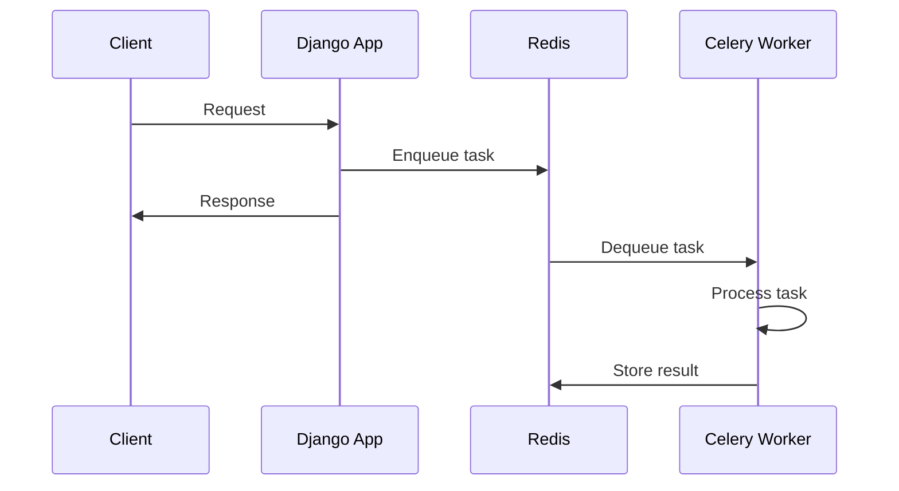

### Django Crypto Exchange

```mermaid
sequenceDiagram
    participant C as Client
    participant D as Django App
    participant R as Redis
    participant W as Celery Worker
    C->>D: Request
    D->>R: Enqueue task
    D->>C: Response
    R->>W: Dequeue task
    W->>W: Process task
    W->>R: Store result
```